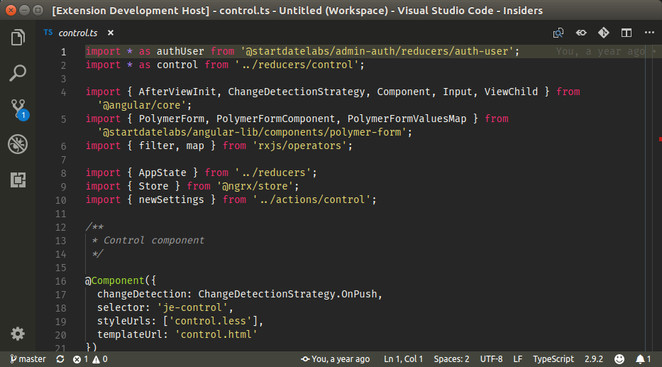
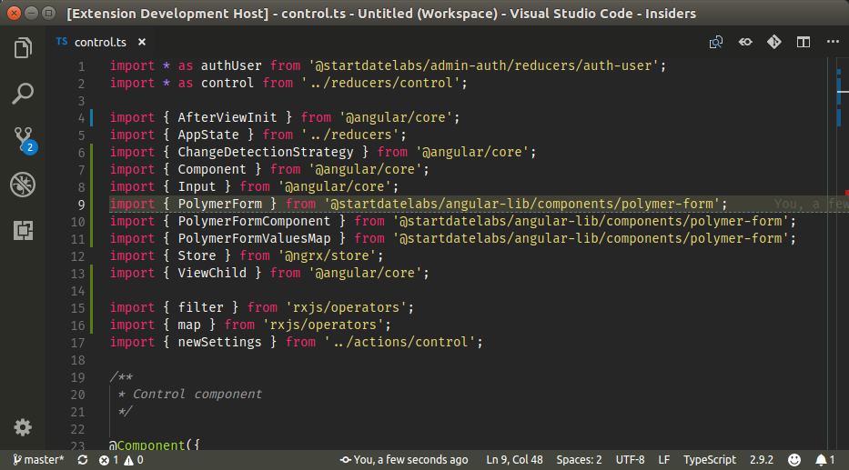

# typescript-import-splitsort

My first, very idiosyncratic VS Code extension that perhaps only I will ever use! There are many excellent import sorters available -- [sort-imports](https://marketplace.visualstudio.com/items?itemName=amatiasq.sort-imports) for example -- but `typescript-import-splitsort` is opinionated:

* imports that reference multiple exports can be *organized* but they can't really be *sorted* without splitting them up, one per line
* if you try to import multiple exports from the same module in one statement, sooner or later you violate the `tslint:line-length` rule; this often hits me with imports from `@angular/core` 
* multi-export imports don't help you eyeball your imports and they disguise their 'weight' in your code

### Before Split'n'Sort



### After Split'n'Sort 



## Features

Automatically splits and sorts imports on save. You can disable this behavior in the settings and split'n'sort manually.

* Launch the command palette with `Ctrl|Cmd+Shift+P`
* Type `Split and sort imports`

Imports are sorted case-sensitive and broken into 6 categories, in this order:

```typescript
import * as vscode from 'vscode';                        // namespace imports

import { ChangeDetectionStrategy } from '@angular/core'; // named class-like imports

import { map } from 'rxjs/operators';                    // named function-like imports

import $ from 'JQuery';                                  // default imports

import zip = require('./ZipCodeValidator');              // external imports

import 'code.js';                                        // string imports
```

Of course, it is very rare for any code to use all these different `import` types.

## Extension Settings

```json
// Automatically split and sort imports on save (default true)
"typescript-import-splitsort.on-save": true
```

## Release Notes

See [CHANGELOG](./CHANGELOG.md).

## Credits

- This fork developed by [Star Mobile Developers](https://github.com/chorpler)
- Originally developed by [Mark Florence](https://github.com/mflorence99).

## Thanks

Many thanks to [sort-imports](https://marketplace.visualstudio.com/items?itemName=amatiasq.sort-imports) for showing the way!

Special thanks to [typescript-parser](https://buehler.github.io/node-typescript-parser/) for a really nice and easy-to-use TypeScript to AST parser.
